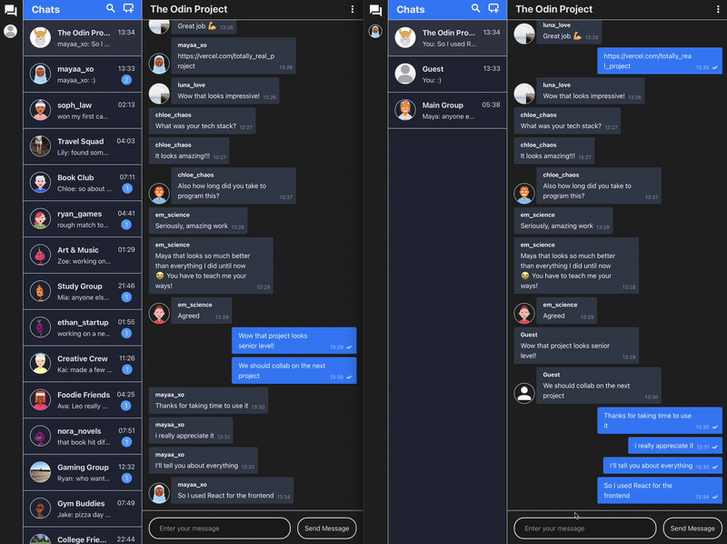

# Real-Time Messaging App
A full-stack messaging platform enabling real-time communication between users, built with TypeScript. Built as part of the [Odin Project Curriculum](https://www.theodinproject.com).

## ✨ Key Features
**Real-time Communication:** Full-featured chat application with Socket.IO for instant messaging, typing indicators, online user tracking, and live notifications 

**Advanced Socket Management:** Complex event handling system managing chat rooms, user sessions, connection cleanup, and real-time user presence across multiple socket connections 

**Comprehensive Chat Features:** Group chats with admin controls, one-on-one messaging, message read status tracking, unread message counts, and chat management  

**Backend Architecture:** TypeScript-based REST API with Socket.IO HTTP server integration, JWT authentication, and PostgreSQL database with Prisma ORM 

**Security & Validation:** AES-256 message encryption with random IV generation, JWT-based authentication, input validation, CORS configuration, and secure real-time event handling 

## 🚀 Live Application
- [View live project](https://project-messaging-app-fawn.vercel.app)

## 🔗 Related Repositories (for more details)
- [Frontend Code](https://github.com/VincentLucht/project-messaging-app/tree/main/frontend)
- [Backend Code](https://github.com/VincentLucht/project-messaging-app/tree/main/backend)

## ⚡️ Tech Stack
### Frontend:

### Backend:

## 📚 What I learned
### The importance of planning
- Insufficient planning lead to backtracking and adding new features - thoroughly planning and laying everything out in the beginning would have made everything easier

### Creating a large-full stack project from scratch
- Gained deep understanding of creating a full-stack project from scratch
- Learned how to use a technology that was alien to me (socket.io) to create something fully functional
- Got the hang of fully deploying a project